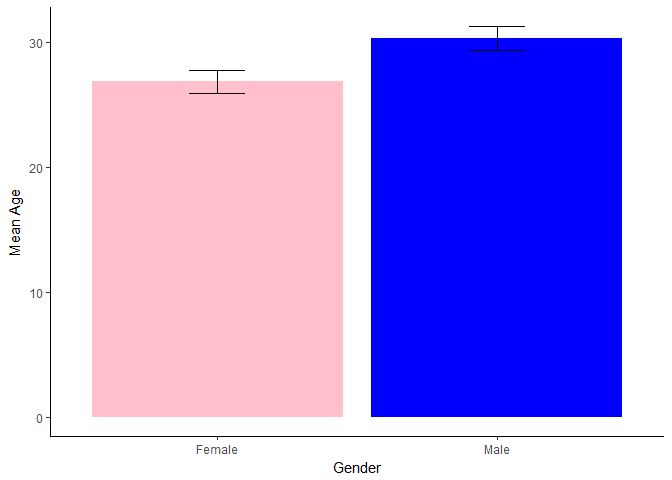

Teaching Notebooks
================

Analysis of a randomly chosen survey from the harvard dataverse.
================================================================

The survey is part of a [dataset](doi:10.7910/DVN/YG9IID). The goal is here to laod the survey, analyse the mean age and standard deviation for each age. Finally, a plot should present the result.

Step 1 Are all neccessary libraries installed?
----------------------------------------------

Otherwise install them. Make sure to update all libraries to the newest version before trying this. For this you can use the installr package. With the include false command this step is not shown in your report later...

Step 2 Load necessary libraries
-------------------------------

    ## -- Attaching packages ----------------------------------------------------------- tidyverse 1.2.1 --

    ## v ggplot2 2.2.1     v purrr   0.2.4
    ## v tibble  1.4.2     v dplyr   0.7.4
    ## v tidyr   0.8.0     v stringr 1.3.0
    ## v readr   1.1.1     v forcats 0.3.0

    ## -- Conflicts -------------------------------------------------------------- tidyverse_conflicts() --
    ## x dplyr::filter() masks stats::filter()
    ## x dplyr::lag()    masks stats::lag()

Step3 get data
--------------

``` r
#get the dataset overview
#be sure to not have a proxy behind a firewall
get_dataset("doi:10.7910/DVN/YG9IID")
```

    ## Dataset (126327): 
    ## Version: 2.0, RELEASED
    ## Release Date: 2017-05-12T20:21:26Z
    ## License: CC0
    ## 13 Files:
    ##                            label version      id
    ## 1          anonymized_survey.csv       1 3005330
    ## 2 Wiki_Founder_Survey_Items.docx       1 3017116
    ##                                                               contentType
    ## 1                                                                text/csv
    ## 2 application/vnd.openxmlformats-officedocument.wordprocessingml.document

``` r
#read in the file
f <- get_file("anonymized_survey.csv", "doi:10.7910/DVN/YG9IID")
# load it into memory
tmp <- tempfile(fileext = ".csv")
writeBin(as.vector(f), tmp)
#get data file
dat <- rio::import(tmp)
rm(f,tmp)
dat<-read.csv("anonymized_survey.csv")
```

Step 4 Analyse data
-------------------

Here two variables are important. year\_born and Sex.

``` r
#format the year variable
current.year<-as.integer(format(Sys.Date(),"%Y"))
#use dply and pipe operator to crete data frame to plot later
plot.dat<-
  dat %>% #use initial data frame
  mutate(age=current.year-year_born) %>% #create a new variable by calculating the age
  filter(age>0&age<100) %>% #remove outliers (some pps gave an age that was too high or negative)
  group_by(Sex) %>% #group the following analysis by pp  sex
  summarise(mean_age=mean(age), #create summary variables (mean and sd)
            sd_age=sd(age),
            N=n(),
            se_age=sd_age/sqrt(N))
#print the resulting dataframe in a table
kable(plot.dat,digits=2)
```

| Sex    |  mean\_age|  sd\_age|    N|  se\_age|
|:-------|----------:|--------:|----:|--------:|
| Female |      26.81|     9.16|  104|     0.90|
| Male   |      30.26|    12.71|  175|     0.96|

Step 5 Plot the result with gender stereotyping colours...
----------------------------------------------------------

``` r
ggplot(aes(y=mean_age,x=Sex,fill=Sex),data=plot.dat)+ #set the aesthetics
  geom_bar(stat="identity")+ #make a bar plot
  geom_errorbar(aes(ymin=mean_age-se_age,ymax=mean_age+se_age,width=0.2))+ #and add error bars
  theme_classic()+ #use the classic theme to remove clutter
  xlab("Gender")+ #add axis labels
  ylab("Mean Age")+
  scale_fill_manual(values=c("pink","blue"))+ #set the colour of bars manually
  theme(legend.position = "none") #no legend needed
```


