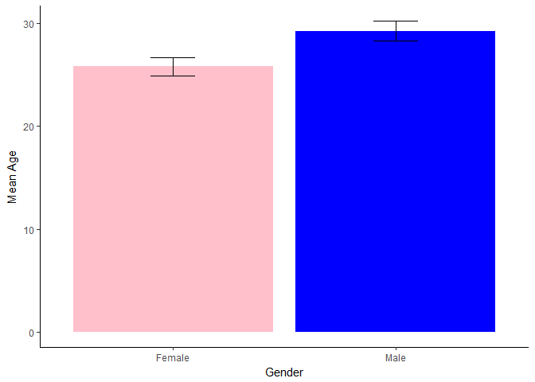

Teaching Notebooks
================

Analysis of a randomly chosen survey from the harvard dataverse.
================================================================

The survey is part of a [dataset](doi:10.7910/DVN/YG9IID). The goal is here to laod the survey, analyse the mean age and standard deviation for each age. Finally, a plot should present the result.

Step 1 Are all neccessary libraries installed?
----------------------------------------------

Otherwise install them. Make sure to update all libraries to the newest version before trying this. For this you can use the installr package. With the include false command this step is not shown in your report later...

Step 2 Load necessary libraries
-------------------------------

    ## Loading tidyverse: ggplot2
    ## Loading tidyverse: tibble
    ## Loading tidyverse: tidyr
    ## Loading tidyverse: readr
    ## Loading tidyverse: purrr
    ## Loading tidyverse: dplyr

    ## Conflicts with tidy packages ----------------------------------------------

    ## filter(): dplyr, stats
    ## lag():    dplyr, stats

Step3 get data
--------------

``` r
dat<-read.csv("anonymized_survey.csv")
```

<!-- ##Step 3 Get data from the Havard dataverse and save it in the variable dat -->
<!-- ```{r} -->
<!-- #get the dataset overview -->
<!-- get_dataset("http://dx.doi.org/doi:10.7910/DVN/YG9IID") -->
<!-- #read in the file -->
<!-- f <- get_file("anonymized_survey.csv", "http://dx.doi.org/doi:10.7910/DVN/YG9IID") -->
<!-- # load it into memory -->
<!-- tmp <- tempfile(fileext = ".csv") -->
<!-- writeBin(as.vector(f), tmp) -->
<!-- #get data file -->
<!-- dat <- rio::import(tmp) -->
<!-- rm(f,tmp) -->
<!-- ``` -->
Step 4 Analyse data
-------------------

Here two variables are important. year\_born and Sex.

``` r
current.year<-as.integer(format(Sys.Date(),"%Y"))
plot.dat<-
  dat %>% 
  mutate(age=current.year-year_born) %>% 
  filter(age>0&age<100) %>% #remove outliers
  group_by(Sex) %>% 
  summarise(mean_age=mean(age),
            sd_age=sd(age),
            N=n(),
            se_age=sd_age/sqrt(N))
kable(plot.dat,digits=2)
```

| Sex    |  mean\_age|  sd\_age|    N|  se\_age|
|:-------|----------:|--------:|----:|--------:|
| Female |      25.81|     9.16|  104|     0.90|
| Male   |      29.26|    12.71|  175|     0.96|

Step 5 Plot the result with gender stereotyping colours...
----------------------------------------------------------

``` r
ggplot(aes(y=mean_age,x=Sex,fill=Sex),data=plot.dat)+geom_bar(stat="identity")+geom_errorbar(aes(ymin=mean_age-se_age,ymax=mean_age+se_age,width=0.2))+theme_classic()+xlab("Gender")+ylab("Mean Age")+scale_fill_manual(values=c("pink","blue"))+theme(legend.position = "none")
```


